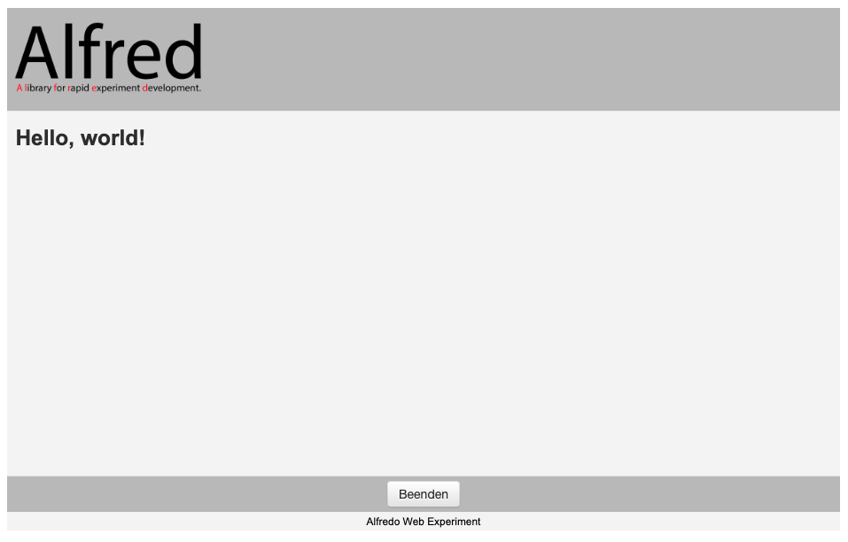

# Alfred "Hello World" experiment
 A minimal "hello world" Alfred experiment for demonstration and testing procedures.

 ## Starting the experiment

You need to have Alfred v0.3b1 installed ([Alfred on GitHub](https://github.com/ctreffe/alfred)).

 1. Download and unpack or clone the repository.
 
 2. Open a terminal window and switch to the experiment directory
 
 ```bash 
 cd PATH-TO-EXPERIMENT
 ```
 
 2. Run the experiment by executing the following code in a terminal window

 ```bash
 python run.py
 ```

 A browser window should open up with the following content:
 
